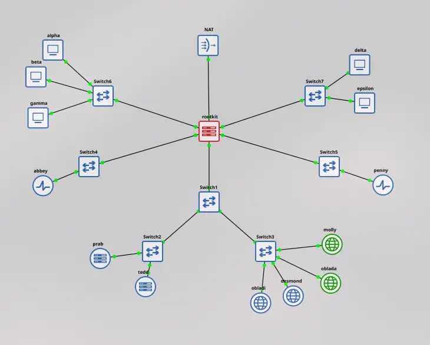
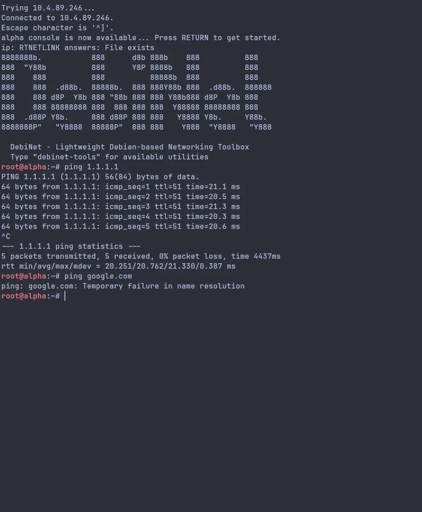
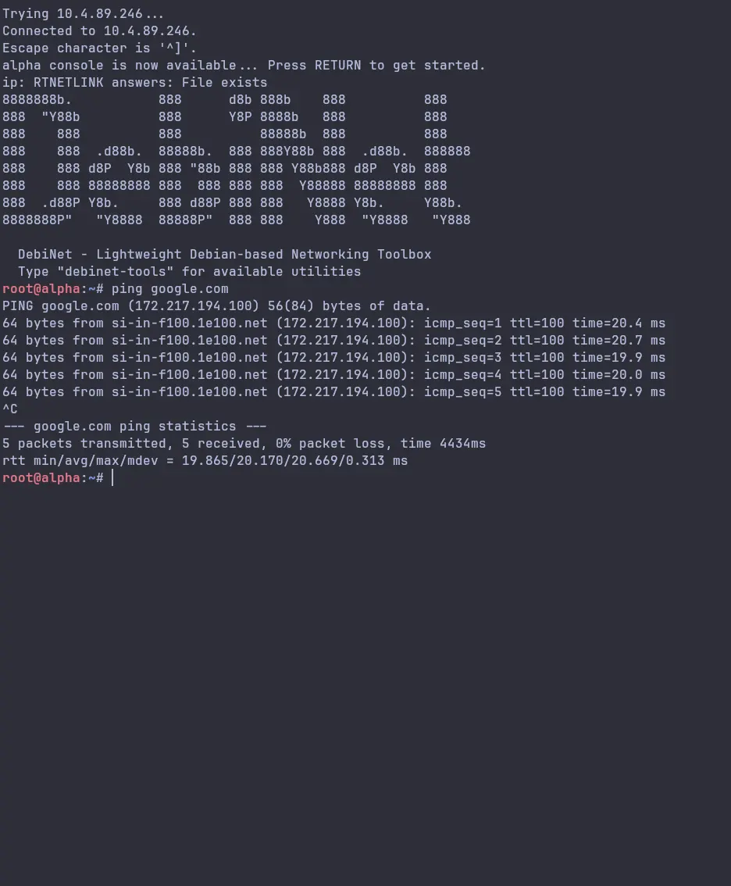
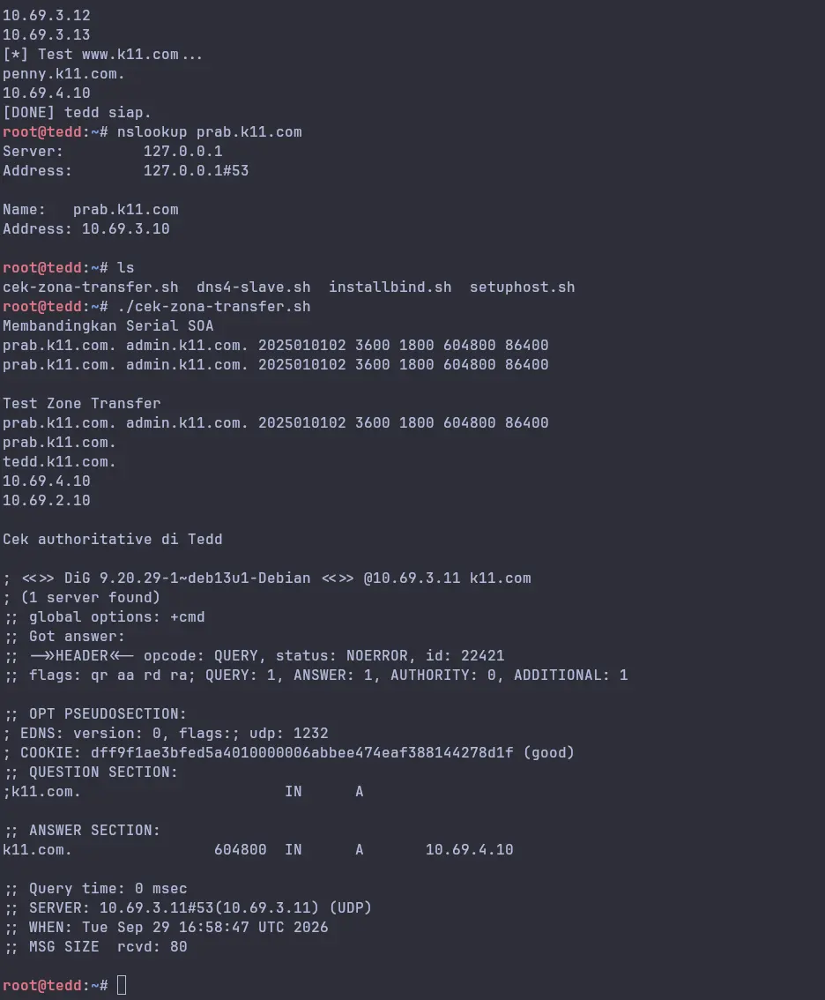
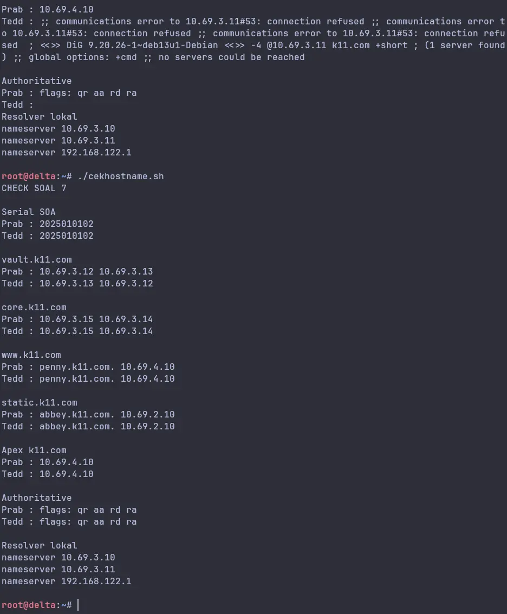
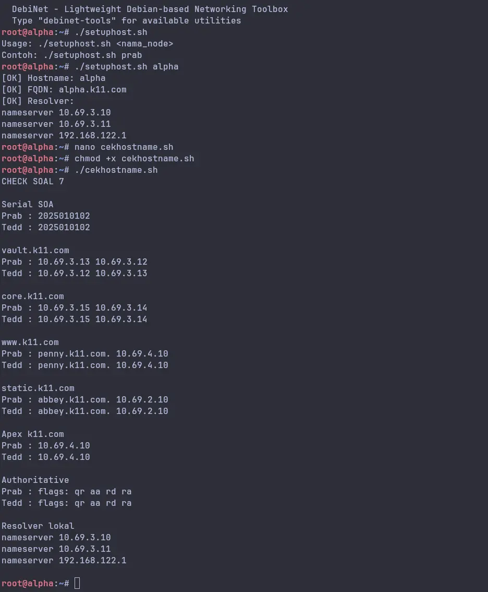

# Jarkom-Modul-2-2026-K-11

## Anggota Kelompok

| Nama                | NRP        | Pembagian Soal | Pembagian Jobdesk                                                      |
| ------------------- | ---------- | -------------- | ---------------------------------------------------------------------- |
| Hasheemi Rafsanjani | 5027251015 |                | Main Solver (menyelesaikan sebagian besar tantangan/soal)              |
| Husam Danish        | 5027251060 |                | Main Editor (Resolve git conflict dan melakukan editing serta koreksi) |

## Laporan Shadow Net Operation

### Glosarium Entitas

```
rootkit : router sentral (gateway)
alpha, beta, gamma : klien sayap kiri (pengamat)
delta, epsilon : klien sayap kanan (eksekutor)
abbey, penny : gerbang penyaring (reverse proxy)
prab : penjaga nama utama (ns1)
tedd : penjaga nama bayangan (ns2)
obladi, desmond : repositori web statis
oblada, molly : repositori web dinamis
<xxxx> : Isi dengan nama kelompok, contoh: K01
Aturan resolver awal : setiap tokoh (host) non-router menambahkan nameserver 192.168.122.1 saat UI aktif (untuk memudahkan akses & instalasi paket yang dibutuhkan di awal).
Penataan ulang resolver : setelah DNS internal hidup (soal 5), urutkan menjadi prab → tedd → 192.168.122.1 pada semua non-router.
Area vault : Kelompok repository web statis yang terdiri dari node obladi dan desmond.
Area core: Kelompok repository web dinamis yang terdiri dari node oblada dan molly.
Kanonik : Hostname utama yang menjadi identitas publik layanan. Semua akses lewat IP atau nama lain akan dialihkan secara permanen ke hostname ini (misal: www.<xxxx>.com).
Disarankan menggunakan >= php8.4-fpm.
```

### 1. The Mesh - set up topology & IP



### 2. Set IP VPC

Router config:

```
auto eth0
iface eth0 inet dhcp

up sysctl -w net.ipv4.ip_forward=1
up iptables -t nat -A POSTROUTING -o eth0 -j MASQUERADE
up iptables -A FORWARD -i eth1 -o eth0 -j ACCEPT
up iptables -A FORWARD -i eth2 -o eth0 -j ACCEPT
up iptables -A FORWARD -i eth3 -o eth0 -j ACCEPT
up iptables -A FORWARD -i eth4 -o eth0 -j ACCEPT
up iptables -A FORWARD -i eth5 -o eth0 -j ACCEPT
up iptables -A FORWARD -i eth0 -m state --state ESTABLISHED,RELATED -j ACCEPT

auto eth1
iface eth1 inet static
address 10.69.1.1
netmask 255.255.255.0

auto eth2
iface eth2 inet static
address 10.69.2.1
netmask 255.255.255.0

auto eth3
iface eth3 inet static
address 10.69.3.1
netmask 255.255.255.0

auto eth4
iface eth4 inet static
address 10.69.4.1
netmask 255.255.255.0

auto eth5
iface eth5 inet static
address 10.69.5.1
netmask 255.255.255.0
```

> Config masing-masing clients: assigning Clients IP

- delta

```
auto lo
iface lo inet loopback

auto eth0
iface eth0 inet static
address 10.69.5.10
netmask 255.255.255.0
gateway 10.69.5.1
```

- epsilon

```
auto lo
iface lo inet loopback

auto eth0
iface eth0 inet static
address 10.69.5.11
netmask 255.255.255.0
gateway 10.69.5.1
```

- penny

```
auto lo
iface lo inet loopback

auto eth0
iface eth0 inet static
address 10.69.4.10
netmask 255.255.255.0
gateway 10.69.4.1
```

- molly

```
auto lo
iface lo inet loopback

auto eth0
iface eth0 inet static
address 10.69.3.15
netmask 255.255.255.0
gateway 10.69.3.1
```

- oblada

```
auto lo
iface lo inet loopback

auto eth0
iface eth0 inet static
address 10.69.3.14
netmask 255.255.255.0
gateway 10.69.3.1
```

- desmond

```
auto lo
iface lo inet loopback

auto eth0
iface eth0 inet static
address 10.69.3.13
netmask 255.255.255.0
gateway 10.69.3.1
```

- obladi

```
auto lo
iface lo inet loopback

auto eth0
iface eth0 inet static
address 10.69.3.12
netmask 255.255.255.0
gateway 10.69.3.1
```

- redd

```
auto lo
iface lo inet loopback

auto eth0
iface eth0 inet static
address 10.69.3.11
netmask 255.255.255.0
gateway 10.69.3.1
```

- prab

```
auto lo
iface lo inet loopback

auto eth0
iface eth0 inet static
address 10.69.3.10
netmask 255.255.255.0
gateway 10.69.3.1
```

- abbey

```
auto lo
iface lo inet loopback

auto eth0
iface eth0 inet static
address 10.69.2.10
netmask 255.255.255.0
gateway 10.69.2.1
```

- gamma

```
auto lo
iface lo inet loopback

auto eth0
iface eth0 inet static
address 10.69.1.12
netmask 255.255.255.0
gateway 10.69.1.1
```

- beta

```
auto lo
iface lo inet loopback

auto eth0
iface eth0 inet static
address 10.69.1.11
netmask 255.255.255.0
gateway 10.69.1.1
```

- alpha

```
auto lo
iface lo inet loopback

auto eth0
iface eth0 inet static
address 10.69.1.10
netmask 255.255.255.0
gateway 10.69.1.1
```



### 3. Set Resolver

> Dari config masing-masing client sebelumnya, selanjutnya kita tambahkan config dns, agar client bisa mengakses domain.

```
#.....config yang sebelumnya
dns-nameservers 192.168.122.1
up echo "nameserver 192.168.122.1" >> /etc/resolv.conf
```



### 4. Authoritative DNS config

```sh
#!/bin/bash
# prab (ns1) = master
# bash dns-zone.sh

TEDD_IP=10.69.3.11

apt update
apt install -y bind9 bind9-utils dnsutils

cat > /etc/bind/named.conf.options <<'EOF'
options {
    directory "/var/cache/bind";
    forwarders { 192.168.122.1; };
    recursion yes;
    allow-recursion { 10.69.0.0/16; 127.0.0.1; };
    dnssec-validation no;
    listen-on { any; };
    listen-on-v6 { none; };
};
EOF

cat > /etc/bind/named.conf.local <<EOF
zone "k11.com" {
    type master;
    file "/etc/bind/db.k11.com";
    notify yes;
    also-notify { $TEDD_IP; };
    allow-transfer { $TEDD_IP; };
};
EOF

cat > /etc/bind/db.k11.com <<'EOF'
$TTL    604800
@       IN      SOA     prab.k11.com. admin.k11.com. (
                              2025010101 ; Serial
                              3600 1800 604800 86400 )
;
@       IN      NS      prab.k11.com.
@       IN      NS      tedd.k11.com.
;
@       IN      A       10.69.4.10
prab    IN      A       10.69.3.10
tedd    IN      A       10.69.3.11
penny   IN      A       10.69.4.10
EOF

named-checkconf
named-checkzone k11.com /etc/bind/db.k11.com

service named restart
sleep 3

echo "=== Cek listen ==="
ss -tlnp | grep :53
echo "=== Cek serial ==="
dig -4 @localhost k11.com SOA +short
```

Verifikasi dari client (alpha), setelah resolver di set di `/etc/network/interfaces` sesuai section 3:

```
dig @10.69.3.10 k11.com +short     # harus 10.69.4.10
dig @10.69.3.11 prab.k11.com +short # harus 10.69.3.10
```


Selanjutnya tambahkan config terkait dns pada masing-masing node:

```
up echo "nameserver 10.69.3.10" > /etc/resolv.conf
up echo "nameserver 10.69.3.11" >> /etc/resolv.conf
```

contoh config pada alpha:

```
auto lo
iface lo inet loopback

auto eth0
iface eth0 inet static
address 10.69.1.10
netmask 255.255.255.0
gateway 10.69.1.1
dns-nameservers 10.69.3.10 10.69.3.11 192.168.122.1
up echo "nameserver 10.69.3.10" > /etc/resolv.conf
up echo "nameserver 10.69.3.11" >> /etc/resolv.conf
up echo "nameserver 192.168.122.1" >> /etc/resolv.conf
```

### 5. Domain dan Hostname

`installbind.sh`

Untuk menambahkan subdomain dan mengkoneksikannya dengan IP address sesuai node dan glosarium makan script `dns-zone.sh` di prab akan menambahkan beberapa A record pada `/db.k11.com` sehingga menjadi

```sh
#!/bin/bash
# /root/install-bind.sh
# Usage:
#   bash install-bind.sh prab    → master
#   bash install-bind.sh tedd    → slave

ROLE=$1

if [ "$ROLE" != "prab" ] && [ "$ROLE" != "tedd" ]; then
    echo "Usage: $0 <prab|tedd>"
    exit 1
fi

# 1. Update & install
apt update
apt install -y bind9 bind9utils dnsutils

# 2. Common options
cat > /etc/bind/named.conf.options <<EOF
options {
    directory "/var/cache/bind";
    forwarders { 192.168.122.1; };
    recursion yes;
    allow-recursion { 10.69.0.0/16; 127.0.0.1; };
    dnssec-validation no;
    listen-on { any; };
    listen-on-v6 { none; };
};
EOF

# 3. Role-specific zone config
if [ "$ROLE" = "prab" ]; then
    # Master
    cat > /etc/bind/named.conf.local <<EOF
zone "k11.com" {
    type master;
    file "/etc/bind/db.k11.com";
    notify yes;
    also-notify { 10.69.3.11; };
    allow-transfer { 10.69.3.11; };
};
EOF

    cat > /etc/bind/db.k11.com <<'EOF'
$TTL    604800
@       IN      SOA     prab.k11.com. admin.k11.com. (
                              2025010101 ; Serial
                              3600       ; Refresh
                              1800       ; Retry
                              604800     ; Expire
                              86400 )    ; Negative Cache TTL
;
@       IN      NS      prab.k11.com.
@       IN      NS      tedd.k11.com.
;
@       IN      A       10.69.4.10      ; Apex -> Penny
prab    IN      A       10.69.3.10
tedd    IN      A       10.69.3.11
penny   IN      A       10.69.4.10
alpha   IN      A       10.69.1.10
beta    IN      A       10.69.1.11
gamma   IN      A       10.69.1.12
abbey   IN      A       10.69.2.10
delta   IN      A       10.69.5.10
epsilon IN      A       10.69.5.11
obladi  IN      A       10.69.3.12
desmond IN      A       10.69.3.13
oblada  IN      A       10.69.3.14
molly   IN      A       10.69.3.15
rootkit IN      A       10.69.3.1
EOF

elif [ "$ROLE" = "tedd" ]; then
    # Slave
    cat > /etc/bind/named.conf.local <<EOF
zone "k11.com" {
    type slave;
    file "/var/cache/bind/db.k11.com";
    masters { 10.69.3.10; };
};
EOF
fi

# 4. Cek syntax
echo "[*] Cek syntax..."
named-checkconf || { echo "[FAIL] named-checkconf"; exit 1; }

if [ "$ROLE" = "prab" ]; then
    named-checkzone k11.com /etc/bind/db.k11.com || { echo "[FAIL] named-checkzone"; exit 1; }
fi

# 5. Restart service
echo "[*] Restart named..."
service named restart
sleep 2
service named status

# 6. Cek listen
echo "[*] Listen port 53:"
ss -tlnp | grep :53 || netstat -tlnp | grep :53

# 7. Test lokal
echo "[*] Test query k11.com..."
dig -4 @localhost k11.com +short

echo "[DONE] $ROLE siap."

```

`setup-hosts.sh`

Melakukan penamaan hostname dan merefer ke subdomain yang telah dibuat, juga mengenali system-wide untuk semua , maka script dijalankan pada setiap node dengan argumen sesuai nama hostname

```sh
#!/bin/bash
# /root/setup-hosts.sh
# Usage: bash setup-hosts.sh <nama_node>
# Contoh: bash setup-hosts.sh prab

NODE=$1

if [ -z "$NODE" ]; then
    echo "Usage: $0 <nama_node>"
    echo "Contoh: $0 prab"
    exit 1
fi

# Set hostname
echo "$NODE" > /etc/hostname
hostname "$NODE"

# Set /etc/hosts
cat > /etc/hosts <<EOF
127.0.0.1       localhost
127.0.1.1       ${NODE}.k11.com          ${NODE}

10.69.3.10      prab.k11.com            prab
10.69.3.11      tedd.k11.com            tedd
10.69.4.10      k11.com                 penny.k11.com   penny
10.69.1.10      alpha.k11.com           alpha
10.69.1.11      beta.k11.com            beta
10.69.1.12      gamma.k11.com           gamma
10.69.2.10      abbey.k11.com           abbey
10.69.5.10      delta.k11.com           delta
10.69.5.11      epsilon.k11.com         epsilon
10.69.3.12      obladi.k11.com          obladi
10.69.3.13      desmond.k11.com         desmond
10.69.3.14      oblada.k11.com          oblada
10.69.3.15      molly.k11.com           molly
10.69.3.1       rootkit.k11.com         rootkit

::1     localhost ip6-localhost ip6-loopback
fe00::0 ip6-localnet
ff00::0 ip6-mcastprefix
ff02::1 ip6-allnodes
ff02::2 ip6-allrouters
EOF

# Set resolver sesuai node
if [ "$NODE" = "prab" ]; then
    echo "nameserver 10.69.3.11" > /etc/resolv.conf
    echo "nameserver 192.168.122.1" >> /etc/resolv.conf
elif [ "$NODE" = "tedd" ]; then
    echo "nameserver 10.69.3.10" > /etc/resolv.conf
    echo "nameserver 192.168.122.1" >> /etc/resolv.conf
else
    echo "nameserver 10.69.3.10" > /etc/resolv.conf
    echo "nameserver 10.69.3.11" >> /etc/resolv.conf
    echo "nameserver 192.168.122.1" >> /etc/resolv.conf
fi

echo "[OK] Hostname: $(hostname)"
echo "[OK] FQDN: $(hostname -f)"
echo "[OK] Resolver:"
cat /etc/resolv.conf
```


### 6. Cek Zona Transfer

Untuk memastikan tedd telah menerima salinan zona terbaru dari prabb, jalankan script dibawah ini pada container tedd:

```sh
#!/bin/bash
echo "Membandingkan Serial SOA"
dig -4 @10.69.3.10 k11.com SOA +short
dig -4 @10.69.3.11 k11.com SOA +short

echo ""
echo "Test Zone Transfer"
dig -4 @10.69.3.10 k11.com AXFR +short | head -5

echo ""
echo "Cek authoritative di Tedd"
dig @10.69.3.11 k11.com
```



### 7. Penambahan A record

Untuk menambahkan A record untuk vault.k11.com serta core.k11.com, tambahkan beberapa konfigurasi tambahan pada `/etc/bind/db.k11.com`. Untuk melakukan itu, disini kami menambahkan beberapa line tambahan pada script `installbind.sh`

```sh
...
molly   IN      A       10.69.3.15
rootkit IN      A       10.69.3.1

; ============================================
; Soal 7: Vault, Core, WWW, Static
; ============================================
; vault -> obladi + desmond (load balance)
vault   IN      A       10.69.3.12
vault   IN      A       10.69.3.13
;
; core -> oblada + molly (load balance)
core    IN      A       10.69.3.14
core    IN      A       10.69.3.15
;
; CNAME alias
www     IN      CNAME   penny.k11.com.
static  IN      CNAME   abbey.k11.com.
EOF
...
```

Selain itu, serialnya juga diganti dari awalnya `2025010101` menjadi `2025010102`:

```sh
...
    cat > /etc/bind/db.k11.com <<'EOF'
$TTL    604800
@       IN      SOA     prab.k11.com. admin.k11.com. (
                              2025010102 ; Serial
                              3600       ; Refresh
...
```

Selanjutnya kita akan melakukan verifikasi pada node `alpha` dan `delta`, bahwa semua hostname sudah terresolve dengan benar, menggunakan script di bawah:
`cekhostname.sh`

```sh
#!/bin/bash
PRAB=10.69.3.10
TEDD=10.69.3.11

# Fungsi untuk mengurangi pengulangan perintah dig
cek() {
    echo "$1"
    echo -n "Prab : "; dig -4 @$PRAB $2 +short | tr '\n' ' '; echo
    echo -n "Tedd : "; dig -4 @$TEDD $2 +short | tr '\n' ' '; echo
    echo ""
}

echo "CHECK SOAL 7"
echo ""

echo "Serial SOA"
echo -n "Prab : "; dig -4 @$PRAB k11.com SOA +short | awk '{print $3}'
echo -n "Tedd : "; dig -4 @$TEDD k11.com SOA +short | awk '{print $3}'
echo ""

# Memanggil fungsi untuk record A, CNAME, dan Apex
cek "vault.k11.com" vault.k11.com
cek "core.k11.com" core.k11.com
cek "www.k11.com" www.k11.com
cek "static.k11.com" static.k11.com
cek "Apex k11.com" k11.com

echo "Authoritative"
echo -n "Prab : "; dig -4 @$PRAB k11.com | grep -o "flags: [^;]*"
echo -n "Tedd : "; dig -4 @$TEDD k11.com | grep -o "flags: [^;]*"
echo ""

echo "Resolver lokal"
grep nameserver /etc/resolv.conf
echo ""
```




# Reverse Zone

Dengan objektif mendeklarasikan reverse zone atau ketika `dig` dengan IP , dia akan mengembalikan hostname dan subdmonain, fungsi tersebut harus dideklarasikan di `prab`, dengan script sebelumnya , maka ditambahkan di `if [ "$ROLE" = "prab" ]`
untuk menambahkan bind ke `10.69.2 - 10.69.4` menuju ke hostname nya

```sh
# Reverse zones
cat >> /etc/bind/named.conf.local <<'EOF'

zone "2.69.10.in-addr.arpa" { type master; file "/etc/bind/db.10.69.2"; notify yes; also-notify { 10.69.3.11; }; allow-transfer { 10.69.3.11; }; };
zone "3.69.10.in-addr.arpa" { type master; file "/etc/bind/db.10.69.3"; notify yes; also-notify { 10.69.3.11; }; allow-transfer { 10.69.3.11; }; };
zone "4.69.10.in-addr.arpa" { type master; file "/etc/bind/db.10.69.4"; notify yes; also-notify { 10.69.3.11; }; allow-transfer { 10.69.3.11; }; };
EOF

cat > /etc/bind/db.10.69.2 <<'EOF'
$TTL 604800
@ IN SOA prab.k11.com. admin.k11.com. ( 2025010103 3600 1800 604800 86400 )
@ IN NS prab.k11.com.
@ IN NS tedd.k11.com.
10 IN PTR abbey.k11.com.
EOF

cat > /etc/bind/db.10.69.3 <<'EOF'
$TTL 604800
@ IN SOA prab.k11.com. admin.k11.com. ( 2025010103 3600 1800 604800 86400 )
@ IN NS prab.k11.com.
@ IN NS tedd.k11.com.
12 IN PTR vault.k11.com.
13 IN PTR vault.k11.com.
14 IN PTR core.k11.com.
15 IN PTR core.k11.com.
EOF

cat > /etc/bind/db.10.69.4 <<'EOF'
$TTL 604800
@ IN SOA prab.k11.com. admin.k11.com. ( 2025010103 3600 1800 604800 86400 )
@ IN NS prab.k11.com.
@ IN NS tedd.k11.com.
10 IN PTR penny.k11.com.
EOF
```

Tambahkan konfigurasi zone slave nya juga di `tedd`

```sh
cat >> /etc/bind/named.conf.local <<'EOF'

zone "2.69.10.in-addr.arpa" { type slave; file "/var/cache/bind/db.10.69.2"; masters { 10.69.3.10; }; };
zone "3.69.10.in-addr.arpa" { type slave; file "/var/cache/bind/db.10.69.3"; masters { 10.69.3.10; }; };
zone "4.69.10.in-addr.arpa" { type slave; file "/var/cache/bind/db.10.69.4"; masters { 10.69.3.10; }; };
EOF
```

Untuk memastikannya dilakukan dig -x dengan IP dari reverse zone yang telah di setting


# Setup Web Statis

Pertama install web server apache pada obladi dan desmond

```sh
apt update
apt install -y apache2
```

Kemudian buat direktori `/var/www/html` dan isi beberapa file uji coba

```sh
mkdir -p /var/www/html/arsip

echo "Ini arsip rahasia k11.com — file 1" > /var/www/html/arsip/dokumen1.txt
echo "Ini arsip rahasia k11.com — file 2" > /var/www/html/arsip/dokumen2.txt
echo "Laporan bulanan" > /var/www/html/arsip/laporan.txt

ls -l /var/www/html/arsip/
```

Aktifkan fitur autoindex / directory listing untuk menampilkan semua file

```sh

nano /etc/apache2/conf-available/arsip.conf

#isi dengan
<Directory /var/www/html/arsip>
    Options Indexes FollowSymLinks
    AllowOverride None
    Require all granted
    IndexOptions FancyIndexing HTMLTable NameWidth=* Charset=UTF-8
</Directory>
```

Jalankan Apache

```sh
a2enconf arsip
apache2ctl configtest
service apache2 restart
```

Di obladi host maupun client seperti alpha,etc, test menggunakan curl

```sh
dig -4 @10.69.3.10 vault.k11.com +short

curl -s http://localhost/arsip/ | head -30

curl -s http://vault.k11.com/arsip/ | head -30
```

Jika sudah muncul seperti HTML dan ada `index of /`
maka sudah berhasil


# Setup Web Dinamis

Install nginx dan PHP 

```sh
apt update 
apt install -y nginx php-fpm php-cli
```

Jalankan PHP-FM nya

```sh
service php8.4-fpm start  
service php8.4-fpm statu
```

Buat dan konfigurasi webserver dinamis PHP nya


```sh

mkdir -p /var/www/core

cat > /var/www/core/index.php <<'EOF'
<?php
$host = gethostname();
$ip   = $_SERVER['SERVER_ADDR'] ?? 'unknown';
?>
<!DOCTYPE html>
<html>
<head><meta charset="UTF-8"><title>Beranda</title></head>
<body>
<h1>Beranda</h1>
<p>Hostname: <?= htmlspecialchars($host) ?></p>
<p>IP: <?= htmlspecialchars($ip) ?></p>
<p>Waktu: <?= date('Y-m-d H:i:s') ?></p>
<ul>
<li><a href="/">Beranda</a></li>
<li><a href="/profil">Profil</a></li>
</ul>
</body>
</html>
EOF

cat > /var/www/core/profil.php <<'EOF'
<?php
$host = gethostname();
$ip   = $_SERVER['SERVER_ADDR'] ?? 'unknown';
?>
<!DOCTYPE html>
<html>
<head><meta charset="UTF-8"><title>Profil</title></head>
<body>
<h1>Profil</h1>
<p>Nama: Mahasiswa K11</p>
<p>NIM: 12345678</p>
<p>Hostname: <?= htmlspecialchars($host) ?></p>
<p>IP: <?= htmlspecialchars($ip) ?></p>
<p>URI: <?= htmlspecialchars($_SERVER['REQUEST_URI']) ?></p>
<p><a href="/">Kembali</a></p>
</body>
</html>
EOF

chown -R www-data:www-data /var/www/core

cat > /etc/nginx/sites-available/core.k11.com <<EOF
server {
    listen 80;
    server_name core.k11.com oblada.k11.com molly.k11.com;
    root /var/www/core;
    index index.php index.html;

    location / {
        try_files \$uri \$uri/ =404;
    }

    location = /profil {
        try_files \$uri /profil.php?\$query_string;
    }

    location ~ \.php\$ {
        include snippets/fastcgi-php.conf;
        fastcgi_pass unix:/run/php/php${PHPVER}-fpm.sock;
        fastcgi_param SCRIPT_FILENAME \$document_root\$fastcgi_script_name;
        include fastcgi_params;
    }
}
EOF

```


Restart PHP dan Nginx nya

```sh
nginx -t
service php8.4-fpm restart
service nginx restart
```


Test koneksi menggunakan curl pada beberapa node client, misal alpha

```sh
# Beranda
curl -s http://core.k11.com/ | head -20

# Profil clean URL
curl -s http://core.k11.com/profil | head -20

# Cek status code
curl -s -o /dev/null -w "Beranda: %{http_code}\n" http://core.k11.com/
curl -s -o /dev/null -w "Profil : %{http_code}\n" http://core.k11.com/profil
```


# Setup Reverse Proxy Server

Pertama install web server apache dan atau nginx pada penny dan abbey

```sh
#penny
apt update
apt install -y apache2 apache2-utils

a2enmod proxy proxy_http proxy_balancer lbmethod_byrequests headers


#abbey
apt update
apt install -y nginx
```

Kemudian setting untuk IP yang akan di forward ke mana sesuai dengan bahasa config masing masing

*Penny*
```sh

cat > /etc/apache2/sites-available/000-default.conf <<'EOF'
<VirtualHost *:80>
    ServerName www.k11.com
    ServerName penny.k11.com

    <Proxy balancer://vaultcluster>
        BalancerMember http://10.69.3.12:80
        BalancerMember http://10.69.3.13:80
        ProxySet lbmethod=byrequests

        RequestHeader set X-Real-IP "expr=%{REMOTE_ADDR}"
        RequestHeader set X-Forwarded-For "expr=%{REMOTE_ADDR}"
    </Proxy>

    ProxyPreserveHost On
    ProxyPass        /  balancer://vaultcluster/
    ProxyPassReverse /  balancer://vaultcluster/
    ProxyPassReverse /  http://10.69.3.12/
    ProxyPassReverse /  http://10.69.3.13/
</VirtualHost>
EOF

echo "ServerName penny.k11.com" > /etc/apache2/conf-available/servername.conf
a2enconf servername

apache2ctl configtest
service apache2 restart

```


*Abbey*

```sh
cat > /etc/nginx/sites-available/core-proxy.conf <<'EOF'
upstream corecluster {
    server 10.69.3.14:80;
    server 10.69.3.15:80;
}

server {
    listen 80;
    server_name static.k11.com abbey.k11.com;

    location / {
        proxy_pass http://corecluster;
        proxy_set_header Host $host;
        proxy_set_header X-Real-IP $remote_addr;
        proxy_set_header X-Forwarded-For $proxy_add_x_forwarded_for;
        proxy_set_header X-Forwarded-Proto $scheme;
    }
}
EOF

ln -sf /etc/nginx/sites-available/core-proxy.conf /etc/nginx/sites-enabled/core-proxy.conf
rm -f /etc/nginx/sites-enabled/default

nginx -t
service nginx restart
```


Kemudian untuk cek IP , saya menggunakan info.php yang akan mendapatkan header dari server

```sh

 cat > /var/www/[core atau /html/arsip]/info.php <<'EOF'
<!DOCTYPE html>
<html>
<head><meta charset="UTF-8"><title>Info Core</title></head>
<body>
<?php
echo "Host: " . ($_SERVER['HTTP_HOST'] ?? '-') . "<br>";
echo "X-Real-IP: " . ($_SERVER['HTTP_X_REAL_IP'] ?? '-') . "<br>";
echo "X-Forwarded-For: " . ($_SERVER['HTTP_X_FORWARDED_FOR'] ?? '-') . "<br>";
echo "Remote: " . ($_SERVER['REMOTE_ADDR'] ?? '-') . "<br>";
echo "Node: " . gethostname() . "<br>";
?>
</body>
</html>
EOF

chown www-data:www-data /var/www/[core atau /html/arsip]/info.php2

```
Cek pada client alpha


# Setup Admin dan Password pada node Penny

Aktifkan apache tools untuk authentication

```sh
a2enmod proxy proxy_http proxy_balancer lbmethod_byrequests headers auth_basic authn_file
```

kemudian ubah konfigurasi , tambahkan basic auth di file `/etc/apache2/sites-available/000-default.conf`

```sh
 Alias /admin /var/www/admin

    <Directory /var/www/admin>
        AuthType Basic
        AuthName "Ruang Rahasia Admin dunia"
        AuthUserFile /etc/apache2/.htpasswd
        Require valid-user
    </Directory>

#allcode same as before
 ProxyPass        /admin !


```

Kemudian restart apache 

```sh
apache2ctl configtest
service apache2 restart
```

Pada salah satu node client , alpha misal , cek

```sh
# no auth 401
curl -s -o /dev/null -w "Tanpa auth: %{http_code}\n" http://www.k11.com/admin/

# Password salah expected 401
curl -s -o /dev/null -w "Salah: %{http_code}\n" -u prabs:wrong http://www.k11.com/admin/

# Kredensial benar 200
curl -s -o /dev/null -w "Benar: %{http_code}\n" -u 'prabs:pakar_pinter_jadi_gob***' http://www.k11.com/admin/

# Isi file rahasia
curl -s -u 'prabs:pakar_pinter_jadi_gob***' http://www.k11.com/admin/rahasia.txt

# Path lain tetap jalan 
curl -s -o /dev/null -w "Vault: %{http_code}\n" http://www.k11.com/arsip/

```

menghasilkan


# Redirect 301 & 302 ketika IP dan Host subdomain

Edit `/etc/apache2/sites-available/000-default.conf` di node penny
dengan menambahkan

```sh
    RewriteEngine On
    RewriteCond %{HTTP_HOST} ^10\.69\.4\.10$ [OR]
    RewriteCond %{HTTP_HOST} ^penny\.k11\.com$ [NC]
    RewriteRule ^/(.*)$ http://www.k11.com/$1 [R=301,L]

```
yaitu rewriteengine yang mengatur redirect baik permanen maupun temporal pada apache dengan mendefinisikan rule dan condition nya, ketentuan soal di penny adalah 301 moved permanennly

perbarui konfigurasi

```sh
a2enmod rewrite
apache2ctl configtest
service apache2 restart
```


kemudian di abbey settingnya cukup berbeda namun simpel yaitu di file `/etc/nginx/sites-available/core-proxy.conf` tambahkan server listen

```nginx
server {
    listen 80;
    server_name abbey.k11.com 10.69.2.10;

    # Redirect sementara (302) ke static.k11.com
    return 302 http://static.k11.com$request_uri;
}
```
dengan me return http code 302 dan memforwardnya ke static.k11.com

restart nginx

```sh
nginx -t
service nginx reload
```

setelah semua telah diubah confignya , coba test pada node alpha 

```sh
# cek penny dan ip nya
curl -sI http://10.69.4.10/arsip/ | head -3

curl -sI http://penny.k11.com/arsip/ | head -3

curl -sI http://www.k11.com/arsip/ | head -3


# cek abbey dan ipnya
curl -sI http://10.69.2.10/ | head -3

curl -sI http://abbey.k11.com/ | head -3

curl -sI http://static.k11.com/ | head -3

```


sudah terbukti dengan keluar http code 301 pada penny dan 302 pada abbey


# Real IP Log

Objektifnya yaitu agar apache log dan nginx log mencatat IP real dari client asli, bukan dari proxy , berdasarkan soal sebelumnya header X-1P dan X-Forward akan ditampilkan di alpha misal iya menampilkan IP dari proxy misal 10.69.4.10 dari penny, namun di soal ini diharapkan untuk menampilkan IP asli clientnya

dan juga berdampak pada log nya , log nya diharapkan juga menampilkan IP asli dari client yang mengakses

pertama , ubah konfigurasi dari apache atau obladi dan desmond, menggunakan util apache remoteip dan remote header nya di set ke X-Real-IP , kemudian format log nya di ubah juga di `/etc/apache2/apache2.conf`


*Obladi & Desmond*
```sh
a2enmod remoteip

cat > /etc/apache2/conf-available/remoteip.conf <<'EOF'
RemoteIPHeader X-Real-IP
RemoteIPInternalProxy 10.69.4.10
RemoteIPInternalProxy 10.69.2.10
EOF

a2enconf remoteip

# Ganti LogFormat: %a → %{X-Real-IP}i
sed -i 's|LogFormat "%a %l %u %t|LogFormat "%{X-Real-IP}i %l %u %t|' /etc/apache2/apache2.conf

apache2ctl configtest
service apache2 restart
```
 kalau di nginx core , tinggal setrealip di file `/etc/nginx/conf.d/realip.conf` dan restart lagi nginx nya

*Oblada & Molly*

```sh
cat > /etc/nginx/conf.d/realip.conf <<'EOF'
set_real_ip_from 10.69.4.10;
set_real_ip_from 10.69.2.10;
real_ip_header X-Real-IP;
real_ip_recursive on;
EOF

nginx -t
service nginx restart
```

dari client jalankan

```sh
curl -s http://www.k11.com/arsip/ > /dev/null
curl -s http://static.k11.com/ > /dev/null
```


cek log di server server nya

```sh
# Cek log
tail -1 /var/log/apache2/access.log   # vault
tail -1 /var/log/nginx/access.log     # core
```

# Setup Eternal dan Orion

seperti hal nya pada setup webserver sebelumnya 
permintaan soal yaitu di penny akan menambahkan jalur path khusus `/eternal` yang mengacu ke `/var/www/eternal` yang bisa merender web dinamis PHP
kemudian di abbey akan ada path `/orion` dengan direktori `/var/www/orion` yang hanya merender statis html

**Penny Eternal**

buat direktori dan file 

```sh

mkdir -p /var/www/eternal

cat > /var/www/eternal/index.php <<'EOF'
<!DOCTYPE html>
<html>
<head><meta charset="UTF-8"><title>Eternal</title></head>
<body>
<?php
echo "Eternal OK<br>";
echo "Host: " . ($_SERVER['HTTP_HOST'] ?? '-') . "<br>";
echo "Node: " . gethostname() . "<br>";
echo "PHP: " . phpversion() . "<br>";
?>
</body>
</html>
EOF

echo "Halo dari /eternal" > /var/www/eternal/info.txt
chown -R www-data:www-data /var/www/eternal
```

install dulu php nya kalau belum

```sh
apt install -y libapache2-mod-php
a2enmod php*

```

perbaru config apache dan tambahkan path ke `/var/www/eternal`

```sh
Alias /eternal /var/www/eternal

<Directory /var/www/eternal>
    Options Indexes FollowSymLinks
    AllowOverride None
    Require all granted
    DirectoryIndex index.php index.html
</Directory>

# ...

ProxyPass        /eternal !
ProxyPass        /  balancer://vaultcluster/
```
restart webserver

```sh

apache2ctl configtest
service apache2 restart
```

**Abbey**

buat direktori dan filenya

```sh

mkdir -p /var/www/orion
echo "<h1>Orion OK</h1>" > /var/www/orion/index.html
echo "File statis orion" > /var/www/orion/data.txt
chown -R www-data:www-data /var/www/orion
```

atur kembali confignya

```sh
upstream corecluster {
    server 10.69.3.14:80;
    server 10.69.3.15:80;
}

server {
    listen 80;
    server_name static.k11.com;

    location /orion/ {
        alias /var/www/orion/;
        autoindex on;
        index index.html;
    }

    location / {
        proxy_pass http://corecluster;
        proxy_set_header Host $host;
        proxy_set_header X-Real-IP $remote_addr;
        proxy_set_header X-Forwarded-For $proxy_add_x_forwarded_for;
    }
}

server {
    listen 80;
    server_name abbey.k11.com 10.69.2.10;

    location /orion/ {
        alias /var/www/orion/;
        autoindex on;
        index index.html;
    }

    location / {
        return 302 http://static.k11.com$request_uri;
    }
}
```

reload nginx

```sh
nginx -t
service nginx reload
```


cek curl di alpha

```sh

# /eternal 
curl -s http://www.k11.com/eternal/

curl -s http://www.k11.com/eternal/info.txt

#/orion
curl -s http://static.k11.com/orion/
curl -s http://static.k11.com/orion/data.txt
curl -s -o /dev/null -w "%{http_code}\n" http://static.k11.com/

curl -sI http://abbey.k11.com/ | head -2

```


